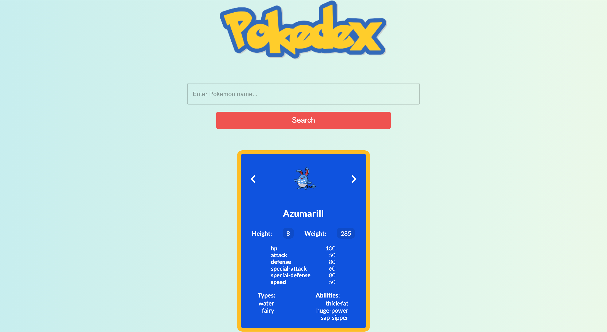
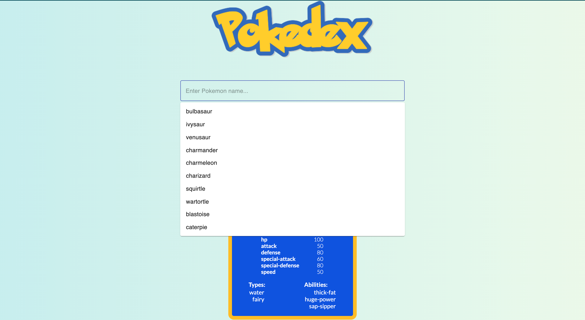

# PokeAPI Pokedex

This app searches the [PokeAPI](https://pokeapi.co/) and displays a Pokemon card. Cards are styled based on their type and search includes autocomplete.

## Screenshots




## Tech Stack

- React
- Material UI
- Emotion Styled Components
- Deployment: Netlify

## Project Setup

```
mkdir <project-directory> && cd <project-directory>
git clone https://github.com/kelsi2/Pokedex
npm i
npm run start
```
